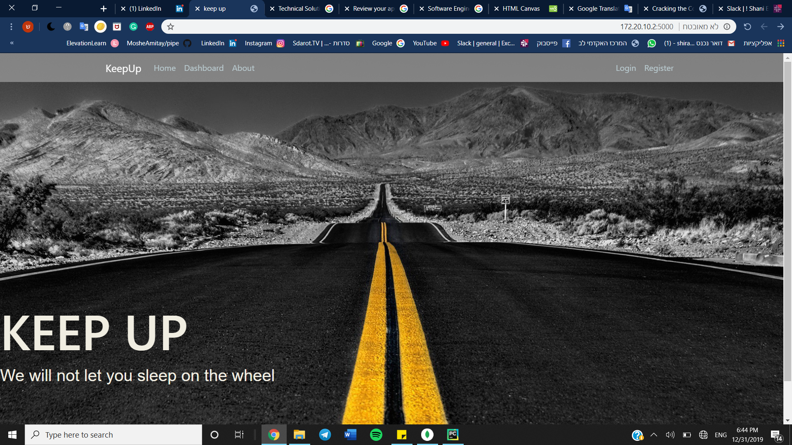

# KeepUp
Alarm system for bus and truck companies, a camera identifies a driver who falls asleep while driving,
and immediately activates an alarm to awaken the sleeping driver, while sending a message to the website 
with the details of the driver and the time he fell asleep.

The alarm system is intended to detect in real time the driver's entering into a dangerous state,and providing an alarm to prevent the situiation from continuing and jeopardizing the driver and others in the surroundings.

The server-side part was created using flask and building a user-friendly website where the company can register its drivers, and see the data collected on drivers who fell asleep while driving. and analyze the data according to the drivers, hours, ages and days.

## Team members
* Shira Zaltsman
* Shani Ehrentreu
* Tirza RubinStein
* Avigial Wilk

## Website Screenshots
 

## Credits and References
* https://docs.opencv.org/3.4/db/d28/tutorial_cascade_classifier.html
* [GPIO - raspberry pi](https://www.raspberrypi.org/documentation/usage/gpio/)
* [flask tutorial](https://blog.miguelgrinberg.com/post/the-flask-mega-tutorial-part-i-hello-world)
* [Flask-MongoEngine](https://flask-mongoengine.readthedocs.io/en/latest/)
* [HTML Canvas](https://www.w3schools.com/graphics/canvas_intro.asp)
* Amitai, Kfir, Ola, Michal, Margalit for tutoring and support

